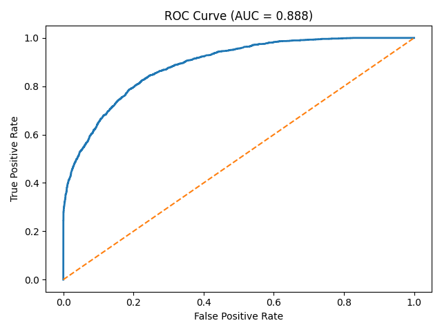
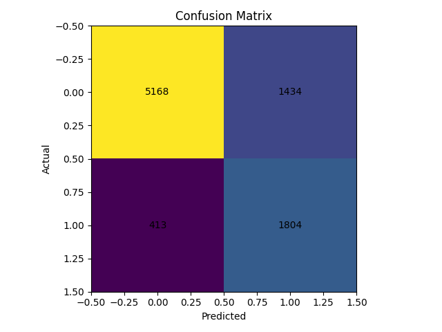
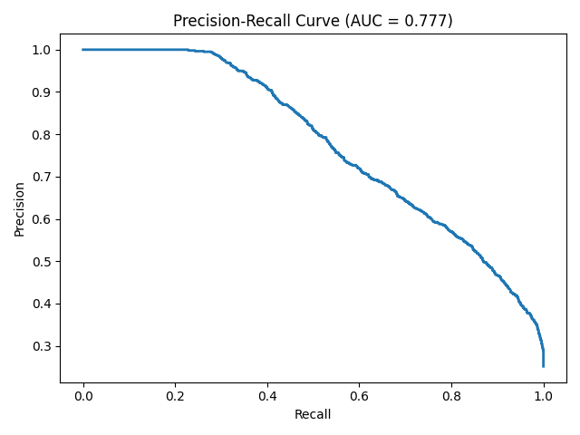
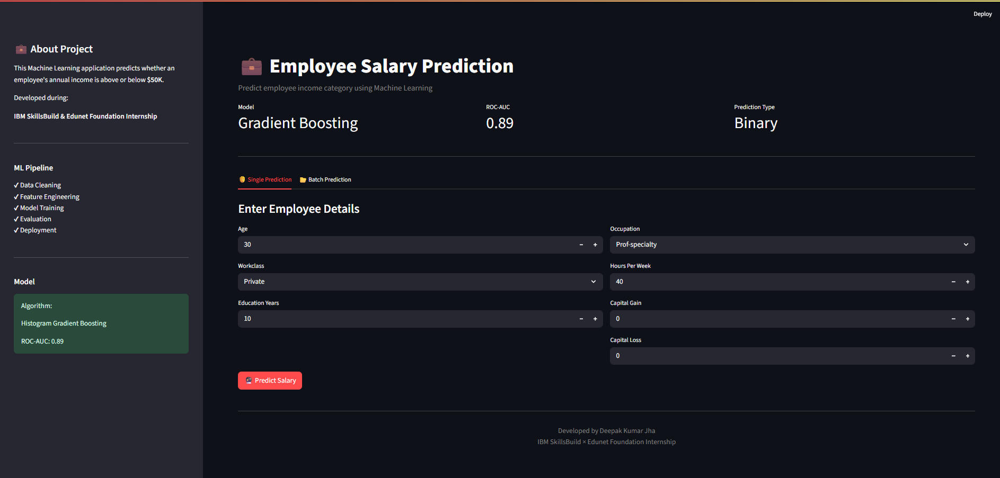
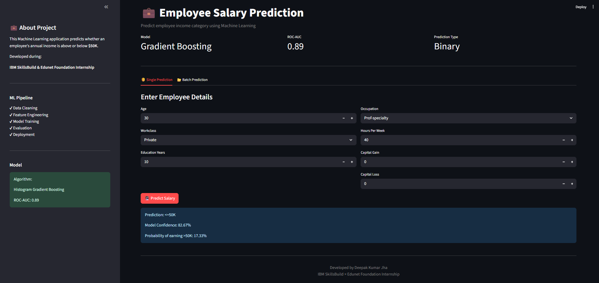
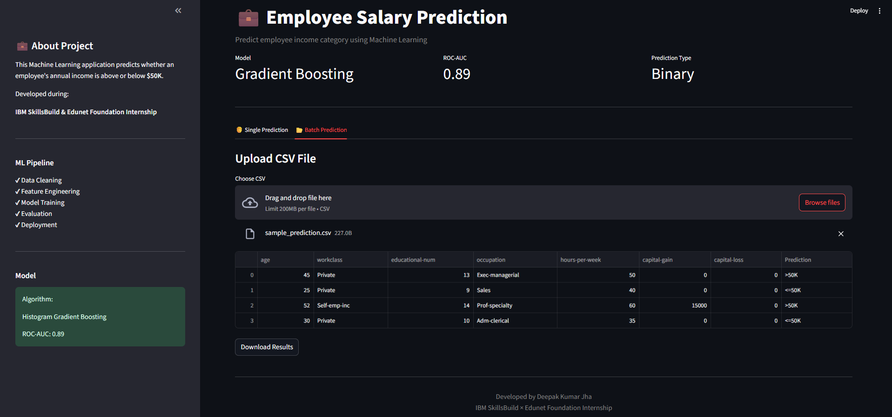

<p align="center">
  
  
  
</p>


# 💼 Employee Salary Prediction using Machine Learning

A Machine Learning based web application that predicts whether an employee earns **more than $50K per year** based on demographic and professional information.

This project was developed as part of the **IBM SkillsBuild & Edunet Foundation Internship Program** to demonstrate the complete Machine Learning lifecycle including:

- Data preprocessing
- Exploratory Data Analysis
- Model Training
- Evaluation
- Deployment using Streamlit


---

## 🚀 Live Demo

🔗 **Application Link:**  
https://employee-salary-prediction-vk18.streamlit.app/

🔗 **GitHub Repository:**  
https://github.com/deepakjha018/employee-salary-prediction


---

# 📌 Project Overview

Employee salary prediction helps analyze how different factors such as education, occupation, working hours, and experience-related attributes influence income categories.

The system predicts:

- `<=50K`
- `>50K`

annual income category using a trained Machine Learning model.


---

# ✨ Features

✔️ Interactive Streamlit Web Interface  
✔️ Single Employee Salary Prediction  
✔️ Batch Prediction using CSV Upload  
✔️ Probability Score Output  
✔️ Machine Learning Pipeline  
✔️ Data Cleaning & Preprocessing  
✔️ Model Evaluation Reports  
✔️ Visualization of Model Performance  


---

# 🧠 Machine Learning Workflow


```text
Dataset Collection
        ↓
Data Cleaning
        ↓
EDA & Feature Selection
        ↓
Feature Encoding + Scaling
        ↓
Model Training
        ↓
Model Evaluation
        ↓
Streamlit Deployment
```

---

# 🗂️ Project Structure


```text
Employee-Salary-Prediction

├── app/
│   └── app.py

├── data/
│   ├── raw/
│   └── processed/

models/
│
├── model_boost_notebook.pkl
└── scaler.pkl

├── notebooks/
│   ├── eda_preprocessing.ipynb
│   └── model_training.ipynb

├── reports/
│   ├── confusion_matrix.png
│   ├── roc_curve.png
│   ├── pr_curve.png
│   └── classification_report.txt

├── screenshots/

├── src/
│   ├── preprocess.py
│   ├── train.py
│   ├── train_boost.py
│   ├── evaluate.py
│   ├── predict.py
│   └── utils.py

├── tests/
│   └── test_model.py

├── requirements.txt
├── README.md
└── .gitignore
```

---

# 📊 Dataset Information

Dataset used:

**Adult Census Income Dataset**

The dataset contains demographic and employment-related attributes.

Important features:

| Feature | Description |
|---|---|
| Age | Employee age |
| Workclass | Employment category |
| Education Number | Years of education |
| Occupation | Job type |
| Hours Per Week | Weekly working hours |
| Capital Gain | Investment gain |
| Capital Loss | Investment loss |


Target:

```text
Income <=50K
Income >50K
```

---

# 🤖 Models Used

Two Machine Learning models were compared:

| Model | ROC-AUC | F1 Score |
|-|-|-|
| Logistic Regression | 0.84 | 0.60 |
| Histogram Gradient Boosting | 0.89 | 0.66 |


Final selected model:

## ⭐ Histogram Gradient Boosting Classifier

Selected because of:

- Better ROC-AUC score
- Better handling of non-linear relationships
- Improved prediction performance


---

# 📈 Model Performance


## ROC Curve

<p align="center">

</p>


## Confusion Matrix

<p align="center">

</p>


## Precision Recall Curve

<p align="center">

</p>


---

# 🖥️ Application Screenshots


## 🏠 Home Page

<p align="center">

</p>


---

## 🔮 Single Prediction

<p align="center">

</p>


---

## 📂 Batch Prediction

<p align="center">

</p>


---

# ⚙️ Installation & Setup


### 1. Clone Repository

```bash
git clone <your-repository-link>

cd Employee-Salary-Prediction
```


### 2. Create Virtual Environment

```bash
python -m venv .venv
```


Activate environment:

Windows:

```bash
.venv\Scripts\activate
```


Linux/Mac:

```bash
source .venv/bin/activate
```


---

### 3. Install Requirements


```bash
pip install -r requirements.txt
```


---

### 4. Run Streamlit App


```bash
streamlit run app/app.py
```


---

# 🧪 Testing


Run unit tests:

```bash
pytest
```


---

# 🛠️ Technologies Used


- Python
- Pandas
- NumPy
- Scikit-Learn
- Matplotlib
- Seaborn
- Streamlit
- Joblib


---

# 🔮 Future Improvements


- Add more ML models
- Hyperparameter optimization
- Explain predictions using SHAP
- Add database integration
- Improve UI/UX


---

# 🙌 Acknowledgement

This project was completed as part of the:

**IBM SkillsBuild & Edunet Foundation Internship Program**

Focused on applying Machine Learning concepts to solve real-world problems.


---

# 👨‍💻 Author

**Deepak Kumar Jha**

B.Tech Artificial Intelligence & Data Science

```
Learning. Building. Improving.
```

